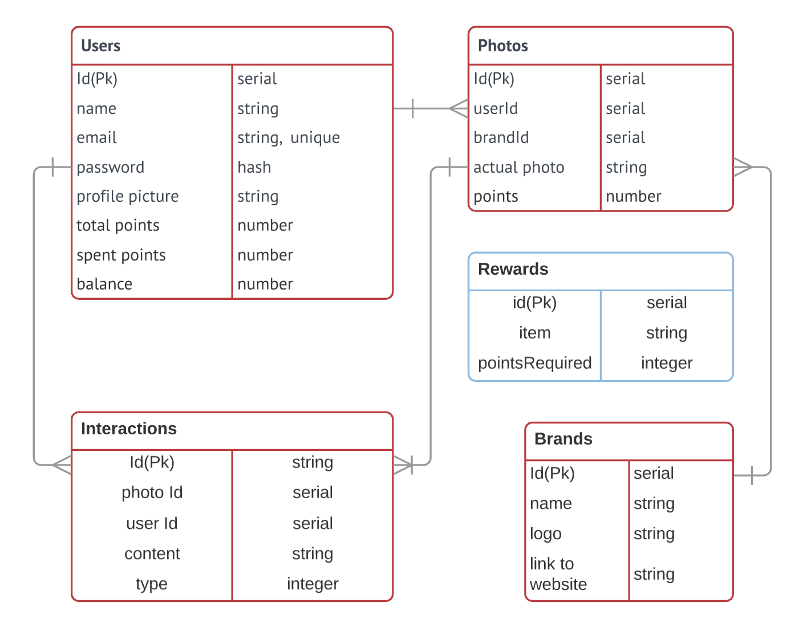
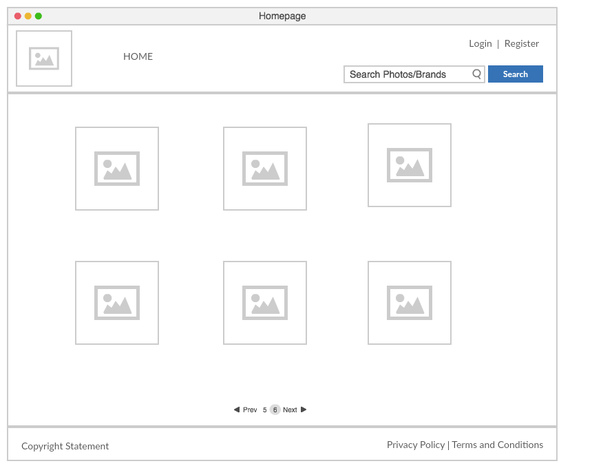
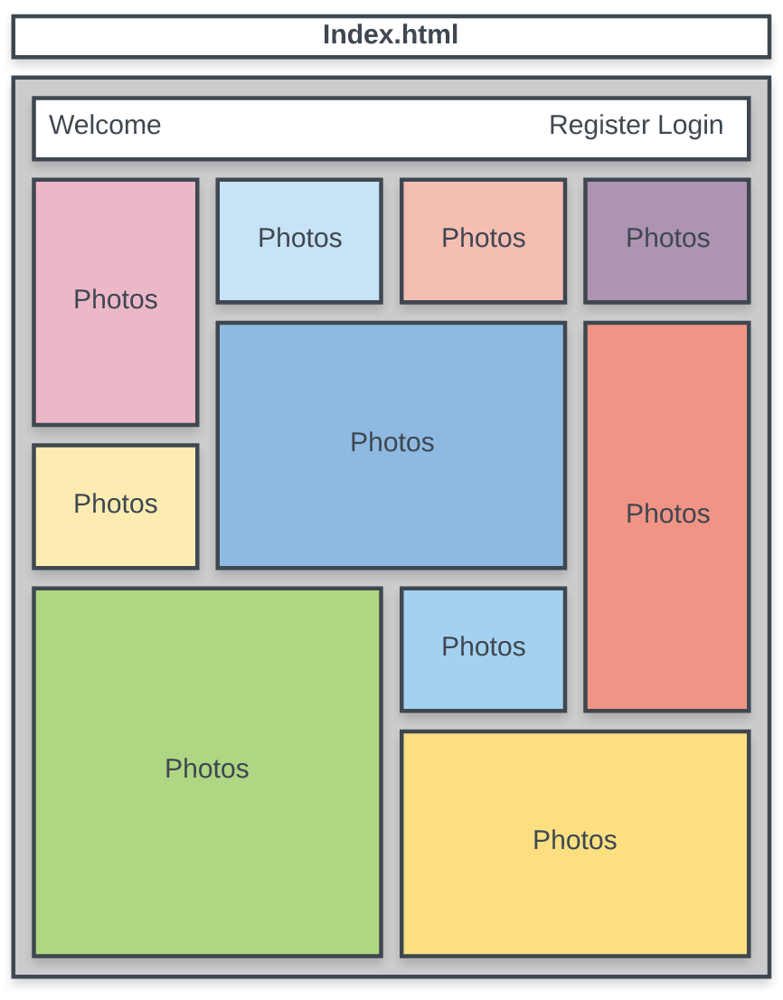
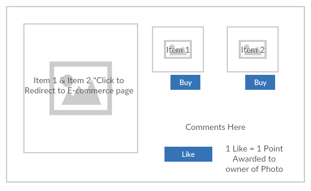
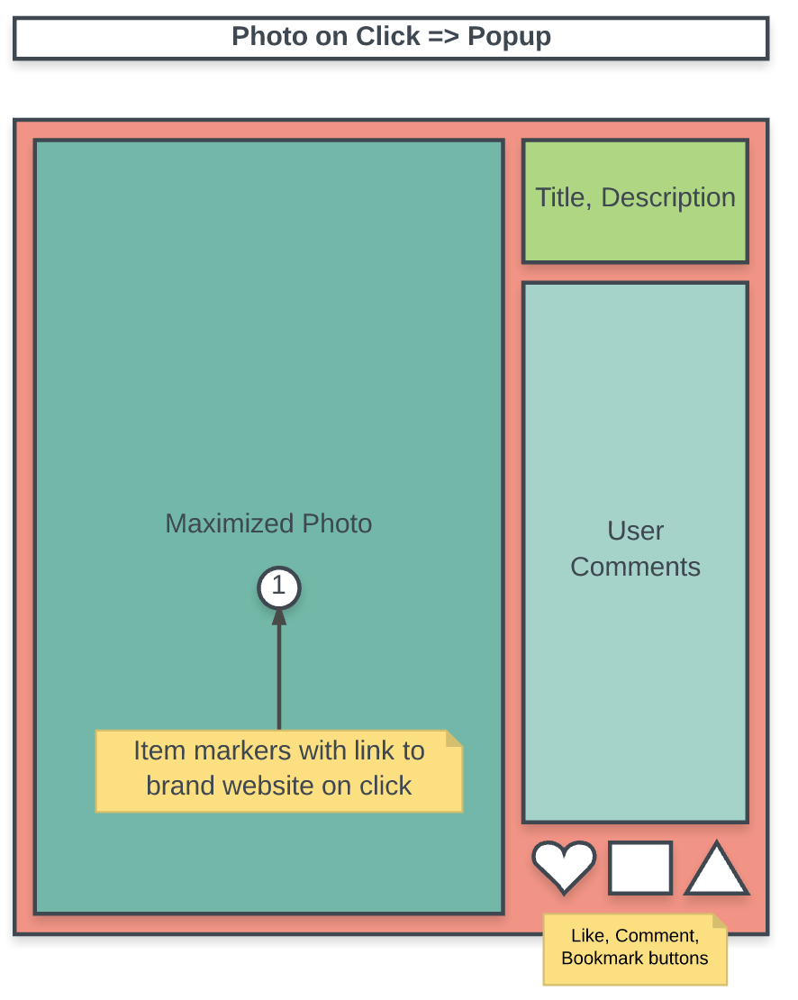
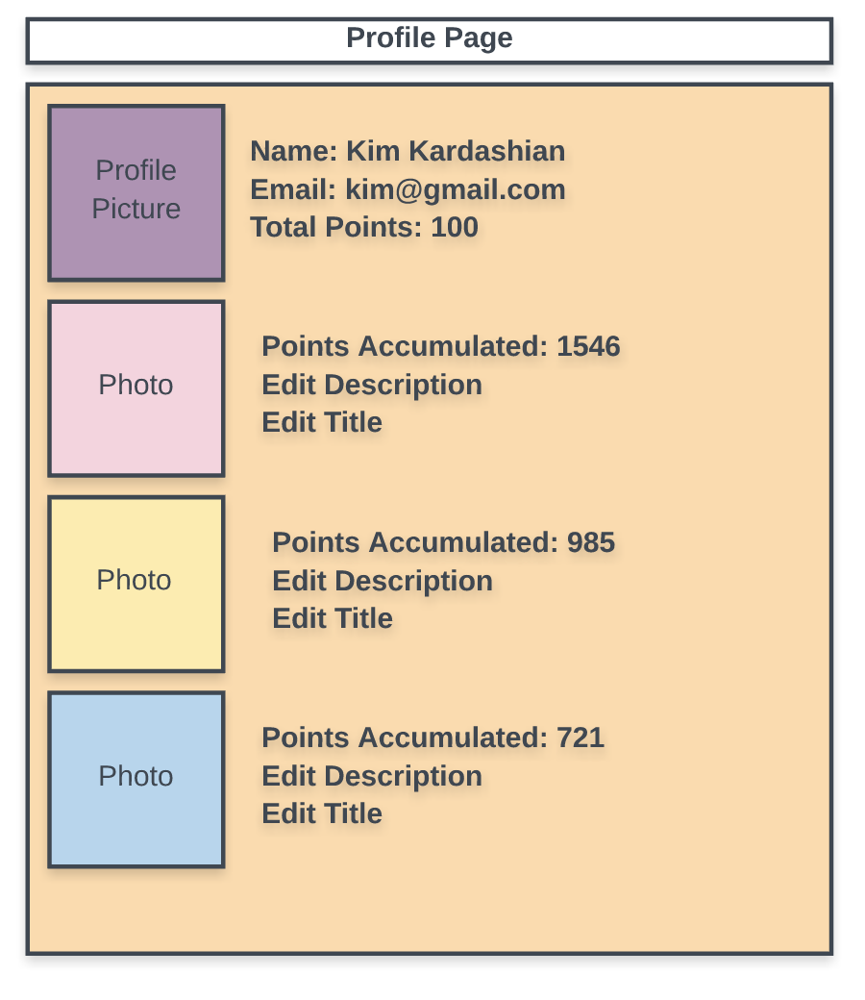

# "Whats That!?" - Yuki, Soe Min, William

Whats That!? is a ...

### User Stories

* **User can upload photos**, with title, description, and tag brands on their photo
* User can like and comment on other user's photos
* User can follow other users
* **User can earn points from uploaded photos**
* User can see how many points each photo earn them and their total available points
* User can spend points at the store, discounts or actual items
* **Each photo will link to the brands displayed in the photos**
* User can search photos by brand and other users

#### Brand creation
* Brand registry

### ERD Diagram



### Link to Application

https://whats-that.herokuapp.com/

-**

### Views

**Pages**
- homepage
- profile pages (users, brands)
- Devise pages
  - login
  - register
  - edit email, password
- upload page
- store (to spend points)

-**

### Controllers

1. **welcome controller**
2. **photos controller**
3. **messages controller**
4. **rewards controller**
5. **followers controller**
6. **users controller** <-- using devise

-**

#### When user is NOT Logged In
**welcome controller**
- Homepage (shows featured photos)

**photos controller**
  - **photos**
    - **GET** When photo is clicked (on homepage/profile page), pop up larger image with links, messages, likes

**messages controller**
  - **messages**
    - **GET** show messages

**rewards controller**
  - **GET** view rewards

**devise**
- **GET** (new) Login --> log in-ed Homepage
- **POST** (create) Register --> log in-ed Homepage
- **GET** (index) Profile --> see others profile, list all **photos** of that profile

#### When user IS Logged In
**welcome controller**
*  Homepage (show followed photos)
  - **photos**
    - GET When photo is clicked (on homepage/profile page), pop up larger image with links, messages, likes
  - **messages**
    - POST (create) Message

**users Controller**
- **PATCH** (update) Edit Profile page --> Update profile photo, change password, change email

**profile Controller**
* If personal
  - Profile --> if personal, see all points earned, edit details
  - **photos**
    - **POST** (create) Upload --> create an upload
    - **GET** When photo is clicked (on homepage/profile page), pop up larger image with links, messages, likes
    - **DELETE** (destroy) button to delete an upload
  - messages
    - POST (create) Message
* Else if other's profile
  - **photos**
    - **GET** When photo is clicked (on homepage/profile page), pop up larger image with links, messages, likes
  - **messages**
    - **POST** (create) Message

### Wireframes

1. Homepage











### Application Setup

Install dependencies
```
bundle Install
```
Set up Database
```
rails db:create
rails db:migrate
```
